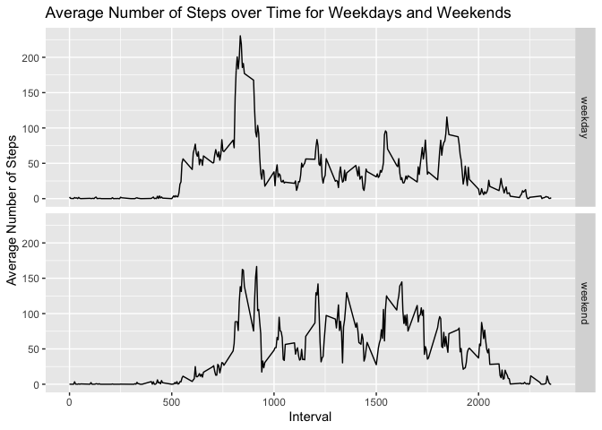

Load in the required libraries.

```r
library(dplyr)
library(ggplot2)
```

## Loading and preprocessing the data


Ensure that the `activity.zip` file is in your working directory. We unzip the file as follows:

```r
if (!file.exists("activity.csv")){
    zipF<- "./activity.zip"
    unzip(zipF)
}
```
Next, we load in the data.

```r
activity <- read.csv("activity.csv")
```
Let's take a look at the first few rows and its structure.

```r
head(activity)
```

```
##   steps       date interval
## 1    NA 2012-10-01        0
## 2    NA 2012-10-01        5
## 3    NA 2012-10-01       10
## 4    NA 2012-10-01       15
## 5    NA 2012-10-01       20
## 6    NA 2012-10-01       25
```

```r
str(activity)
```

```
## 'data.frame':	17568 obs. of  3 variables:
##  $ steps   : int  NA NA NA NA NA NA NA NA NA NA ...
##  $ date    : chr  "2012-10-01" "2012-10-01" "2012-10-01" "2012-10-01" ...
##  $ interval: int  0 5 10 15 20 25 30 35 40 45 ...
```

There appears to be multiple missing values in the **steps** column and the data type of the **date** column is "character". Let's convert the **date** column to a proper date format and remove these missing values first.

```r
activity$date <- as.Date(activity$date, "%Y-%m-%d")
activity_no_na <- activity[!is.na(activity$steps),]
str(activity_no_na)
```

```
## 'data.frame':	15264 obs. of  3 variables:
##  $ steps   : int  0 0 0 0 0 0 0 0 0 0 ...
##  $ date    : Date, format: "2012-10-02" "2012-10-02" ...
##  $ interval: int  0 5 10 15 20 25 30 35 40 45 ...
```

## What is mean total number of steps taken per day?

We first calculate the sum of steps each day and plot a histogram.

```r
sum_of_steps <- with(activity_no_na, tapply(steps,date,sum))
hist(sum_of_steps, breaks=20, xlab="Total number of steps", main="Histogram of total number of steps", col='lightblue')
```

<!-- -->

Computing the mean and median of the total number of steps taken per day, we obtain:

```r
paste("Mean: ",mean(sum_of_steps))
```

```
## [1] "Mean:  10766.1886792453"
```

```r
paste("Median: ",median(sum_of_steps))
```

```
## [1] "Median:  10765"
```

## What is the average daily activity pattern?


We compute the average number of steps taken for each interval and make a time series plot as follows:

```r
avr_steps <- with(activity_no_na, tapply(steps, interval, mean))
interval <- unique(activity_no_na$interval)
plot(interval,avr_steps, type="l", xlab="Interval", ylab="Average Number of Steps", main="Average Number of Steps per Interval")
```

<!-- -->

To determine the 5-minute interval with maximum number of steps, we do the following:

```r
paste("The 5-minute interval with maximum number of steps is", names(avr_steps[avr_steps == max(avr_steps)]))
```

```
## [1] "The 5-minute interval with maximum number of steps is 835"
```


## Imputing missing values


We will be using the dataframe `activity` that contains the missing values in the **steps** column. We compute the number of missing values as follows:

```r
paste("Total number of missing values in the dataset is", sum(is.na(activity$steps)))
```

```
## [1] "Total number of missing values in the dataset is 2304"
```

There are several methods to impute missing values and we will be replacing them with the mean of the 5-minute intervals. Store it in a new dataframe `activity_imputed` as follows:

```r
activity_imputed <- activity %>% group_by(interval) %>% mutate(steps=ifelse(is.na(steps), mean(steps, na.rm=TRUE), steps))
```

Using this new dataframe, we plot a similar histogram of the total number of steps taken each day.

```r
sum_of_steps <- with(activity_imputed, tapply(steps,date,sum))
hist(sum_of_steps, breaks=20, xlab="Total number of steps", main="Histogram of total number of steps after imputing", col='lightgreen')
```

<!-- -->

Computing the mean and median of the total number of steps taken per day, we obtain:

```r
paste("Mean after imputing: ",mean(sum_of_steps))
```

```
## [1] "Mean after imputing:  10766.1886792453"
```

```r
paste("Median after imputing: ",median(sum_of_steps))
```

```
## [1] "Median after imputing:  10766.1886792453"
```
We observe that the mean and median when the missing values are imputed are similar to when the missing values were removed. This should be the case since we would not want the imputing to skew the mean or median.


## Are there differences in activity patterns between weekdays and weekends?

We create a new factor variable **weekday** in the dataframe where the value of 1 indicates that the date is a weekday and 0 if it is a weekend.

```r
activity_imputed$weekday <- ifelse(weekdays(activity_imputed$date) %in% c("Saturday", "Sunday"), "weekend","weekday")
activity_imputed$weekday <- as.factor(activity_imputed$weekday)
str(activity_imputed$weekday)
```

```
##  Factor w/ 2 levels "weekday","weekend": 1 1 1 1 1 1 1 1 1 1 ...
```

Plotting the panel plot of the 5-minute interval against the average number of steps taken for weekdays and weekends, we obtain:

```r
avg_steps_weekday <- activity_imputed %>% group_by(interval,weekday) %>% summarise(avg=mean(steps))
ggplot(avg_steps_weekday, aes(interval,avg)) + geom_line() + facet_grid(weekday~.)
```

<!-- -->

